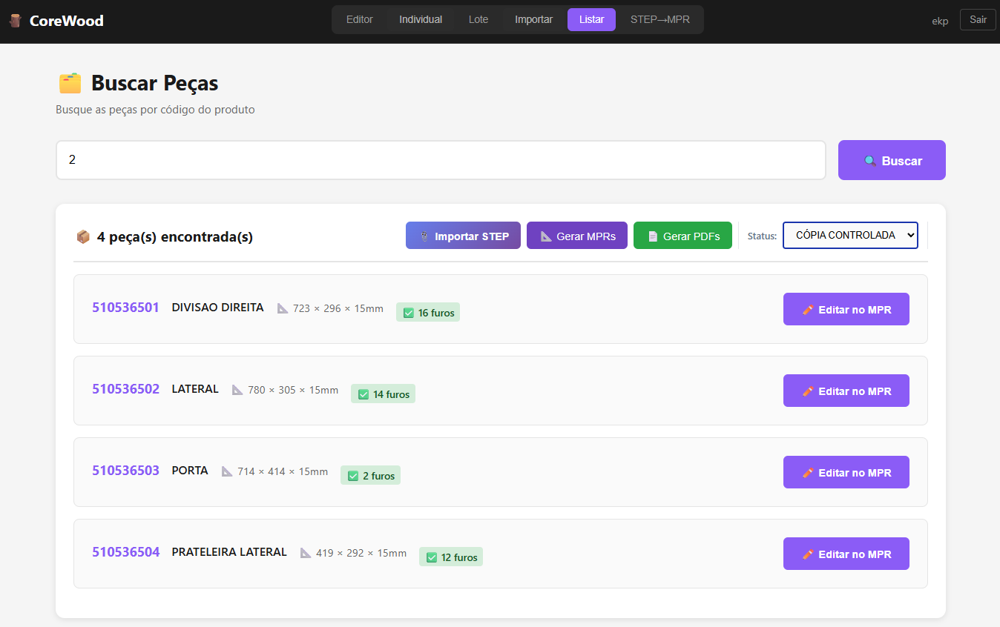
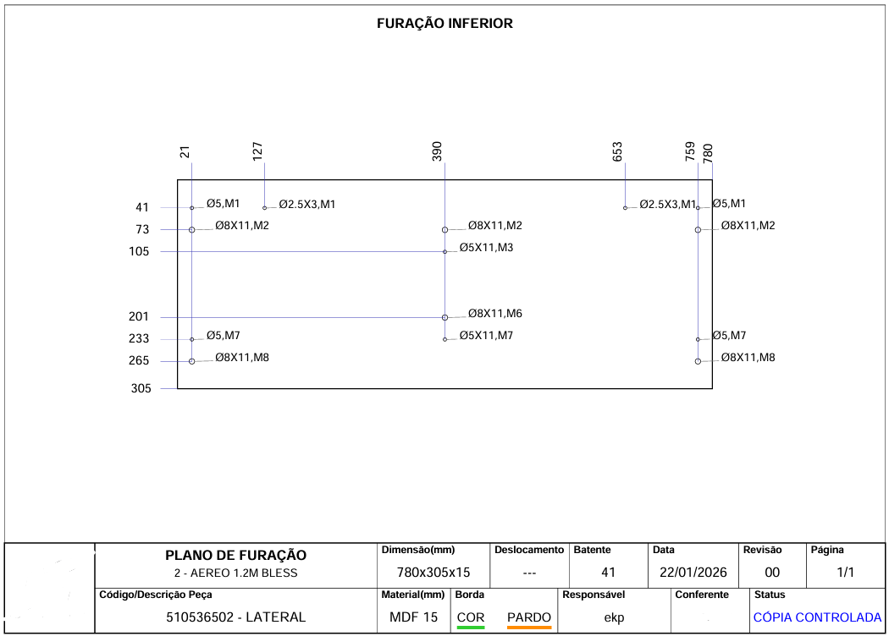

# CoreWood

**Industrial automation platform that bridges CAD design to CNC manufacturing**

CoreWood automates the conversion of CAD files (STEP) to CNC machine code and generates technical documentation — reducing programming time by 96% and documentation errors by 40%.

---

## 🎯 The Problem

In furniture manufacturing, the process from CAD design to CNC production involves:
- Manual interpretation of 3D models
- Time-consuming CNC code programming
- Repetitive technical documentation creation
- Scattered information across multiple systems
- High error rates in drilling patterns and specs

This workflow was taking **hours per piece** and causing production delays.

---

## 💡 The Solution

CoreWood is a full-stack web application that automates the entire flow:

```
STEP File → Parse 3D Data → Generate CNC Code → Create Documentation
```

All in one platform, with just a few clicks.

---

## ⚡ Key Features

| Feature | Description |
|---------|-------------|
| **STEP Parser** | Extracts geometric data from CAD files (dimensions, drilling points, materials) |
| **CNC Code Generator** | Automatically converts 3D models to machine-ready CNC code |
| **Drilling Editor** | Visual editor for CNC drilling patterns with real-time preview |
| **Documentation Generator** | Auto-generates technical sheets for production |
| **Parts Management** | Centralized database for all product components |
| **History & Versioning** | Track changes and access previous versions |
| **ERP Integration** | Syncs with Senior ERP for seamless workflow |

---

## 🏗️ Architecture

```
┌─────────────────────────────────────────────────────────────┐
│                        Frontend                             │
│                         React                               │
└─────────────────────┬───────────────────────────────────────┘
                      │ REST API
┌─────────────────────▼───────────────────────────────────────┐
│                        Backend                              │
│                        FastAPI                              │
│                                                             │
│  ┌─────────────┐  ┌─────────────┐  ┌─────────────────────┐  │
│  │ STEP Parser │  │ CNC Engine  │  │ Doc Generator       │  │
│  │ (pythonOCC) │  │             │  │                     │  │
│  └─────────────┘  └─────────────┘  └─────────────────────┘  │
└─────────────────────┬───────────────────────────────────────┘
                      │
┌─────────────────────▼───────────────────────────────────────┐
│                      Database                               │
│                     PostgreSQL                              │
└─────────────────────────────────────────────────────────────┘
                      │
                      ▼
              ┌────────────────┐
              │ HOMAG Machines | 
              |       and      |
              |   Senior ERP   │
              └────────────────┘
```

---

## 🛠️ Tech Stack

**Frontend**
- React 18
- CSS Modules

**Backend**
- Python 3.11
- FastAPI
- pythonOCC (CAD parsing)
- SQLAlchemy

**Database**
- PostgreSQL

**Integrations**
- Senior ERP (REST API)
- HOMAG Machines

---

## 📊 Results

| Metric | Before | After | Impact |
|--------|--------|-------|--------|
| Programming time per piece | ~2 hours | ~5 minutes | **96% reduction** |
| Documentation errors | Frequent | Rare | **40% reduction** |
| Information lookup time | 30+ min | < 1 min | **50% reduction** |
| Teams using the platform | - | 5 areas | P&D, Engineering, Processes, Quality, Management |
| Active users | 8 

---

## 📸 Screenshots

### STEP File Parser


### CNC Drilling Editor


### Technical Documentation


---

## 🚀 How It Works

1. **Upload STEP file** — Import 3D CAD model from TopSolid or other CAD software
2. **Automatic parsing** — pythonOCC extracts geometry, dimensions, and drilling points
3. **Review & edit** — Use the visual editor to adjust drilling patterns if needed
4. **Generate CNC code** — One click to create machine-ready code
5. **Export documentation** — Auto-generated technical sheets for production team

---

## 🏭 Context

CoreWood was developed at **Linea Brasil**, a furniture manufacturing company in Arapongas, PR, Brazil. The platform is used daily by the Product Development, Processes, and Engineering teams to streamline the journey from design to production.

---

## 👤 Author

**Enzo Pedrican**
- [LinkedIn](https://linkedin.com/in/seu-linkedin)
- [GitHub](https://github.com/seu-github)
- [Email](mailto:enzo.pedrica@gmail.com)

---

## 📄 License

This repository contains documentation only. The source code is proprietary.

---
