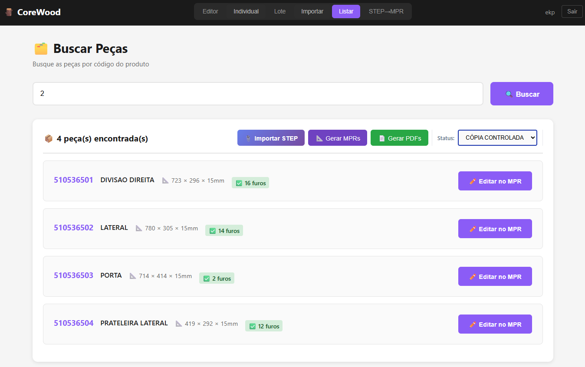
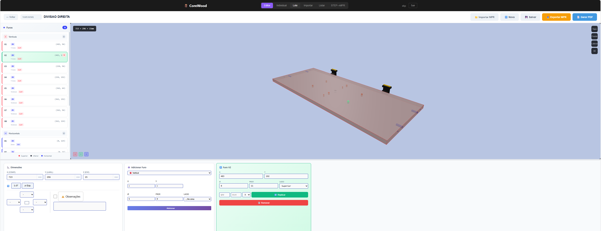
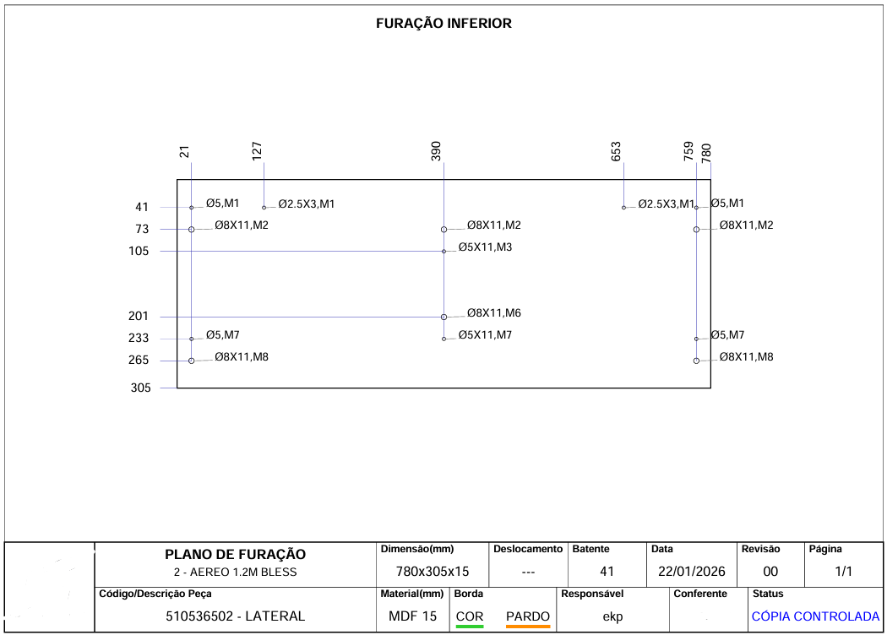

# 🪵 CoreWood

**Plataforma de centralização e automação industrial para o fluxo CAD → CNC na indústria moveleira**

O CoreWood nasceu da necessidade de centralizar as informações de produto em um único lugar. A partir de uma entrada de dados — como um arquivo STEP ou uma ficha de peça — a plataforma gera automaticamente tudo que a produção precisa: código CNC para as máquinas, documentação técnica de furação e usinagem, e o roteiro de produção por peça. Resultado: redução de 96% no tempo de programação e 40% nos erros de documentação.

---

## 🎯 O Problema

Na fabricação de móveis, o caminho entre o projeto CAD e a produção CNC envolve:

- Interpretação manual de modelos 3D
- Programação manual e demorada de código CNC
- Criação repetitiva de fichas técnicas e documentação
- Informações dispersas em múltiplos sistemas
- Alta taxa de erros em padrões de furação e especificações

Esse fluxo consumia **horas por peça** e gerava atrasos recorrentes na produção.

---

## 💡 A Solução

O CoreWood é uma aplicação web full-stack que automatiza todo esse processo em uma única plataforma:

```
Arquivo STEP → Leitura 3D → Geração de Código CNC → Documentação Técnica → Roteiro de Peça
```
---

## ⚡ Funcionalidades

| Módulo | Descrição |
|--------|-----------|
| **Parser STEP** | Extrai dados geométricos de arquivos CAD (dimensões, pontos de furação, materiais) |
| **Gerador CNC** | Converte automaticamente modelos 3D em código pronto para a máquina |
| **Editor de Furação** | Editor visual de padrões de furação CNC com visualização em tempo real |
| **Gerador de Documentação** | Gera fichas técnicas de produção automaticamente |
| **Gestão de Peças** | Banco de dados centralizado de todos os componentes e produtos |
| **Histórico e Versionamento** | Rastreamento de alterações e acesso a versões anteriores |
| **Integração ERP** | Sincronização com o ERP Senior para importação e exportação de dados |
| **Roteiro de Peças** | Processa exportações do ERP e gera arquivos TXT para reimportação |
| **Módulo de Suporte** | Sistema interno de tickets para registro e acompanhamento de chamados |

---

## 🏗️ Arquitetura

```
┌──────────────────────────────────────────────────────────────┐
│                         Frontend                             │
│                          React                               │
└──────────────────────┬───────────────────────────────────────┘
                       │ REST API
┌──────────────────────▼───────────────────────────────────────┐
│                         Backend                              │
│                         FastAPI                              │
│                                                              │
│  ┌──────────────┐  ┌──────────────┐  ┌────────────────────┐  │
│  │ Parser STEP  │  │ Motor CNC    │  │ Gerador de Docs    │  │
│  │ (pythonOCC)  │  │              │  │                    │  │
│  └──────────────┘  └──────────────┘  └────────────────────┘  │
└──────────────────────┬───────────────────────────────────────┘
                       │
┌──────────────────────▼───────────────────────────────────────┐
│                       Banco de Dados                         │
│                        PostgreSQL                            │
└──────────────────────┬───────────────────────────────────────┘
                       │
                       ▼
            ┌──────────────────────┐
            │   Máquinas HOMAG     │
            │         e            │
            │      ERP Senior      │
            └──────────────────────┘
```

---

## 🛠️ Stack Tecnológico

**Frontend**
- React 18
- CSS Modules

**Backend**
- Python 3.11
- FastAPI
- pythonOCC (leitura e processamento de geometria CAD)
- SQLAlchemy + Alembic

**Banco de Dados**
- PostgreSQL

**Infraestrutura**
- Docker Compose (Nginx + FastAPI + PostgreSQL)
- Deploy em servidor Linux

**Integrações**
- ERP Senior (REST API)
- Máquinas CNC HOMAG/Weeke (formato MPR)

---

## 📸 Capturas de Tela

### Parser de Arquivo STEP


### Editor de Furação CNC


### Documentação Técnica Gerada


---

## 🚀 Como Funciona

1. **Upload do arquivo STEP** — Importe o modelo 3D exportado do TopSolid ou outro software CAD
2. **Leitura automática** — O pythonOCC extrai geometria, dimensões e pontos de furação
3. **Revisão e ajuste** — Use o editor visual para corrigir ou complementar padrões de furação
4. **Geração do código CNC** — Um clique cria o arquivo pronto para envio à máquina
5. **Exportação da documentação** — Fichas técnicas geradas automaticamente para a equipe de produção
6. **Relatório para Importação** — Roteiro de Produção para importar para o ERP

---

## 🏭 Contexto

O CoreWood foi desenvolvido na **Linea Brasil**, empresa fabricante de móveis localizada em Arapongas, PR. A plataforma esta em desenvolvimento onde será utilizada diariamente pelas equipes de Desenvolvimento de Produto, Processos e Engenharia, integrando o fluxo completo do projeto à produção.

O CoreWood nasceu da necessidade de centralizar as informações de produto em um único lugar. A partir de uma entrada de dados — como um arquivo STEP ou uma ficha de peça — a plataforma gera automaticamente tudo que a produção precisa: código CNC para as máquinas, documentação técnica de furação e usinagem, e o roteiro de produção por peça.
---

## 👤 Desenvolvedor

**Enzo Koyano Pedriça**  

- [LinkedIn](https://www.linkedin.com/in/enzo-koyano-pedriça)
- [GitHub](https://github.com/enzokpedrica)
- [E-mail](mailto:enzo.pedrica@gmail.com)

---

## 📄 Licença

Este repositório contém apenas documentação. O código-fonte é proprietário.

---
